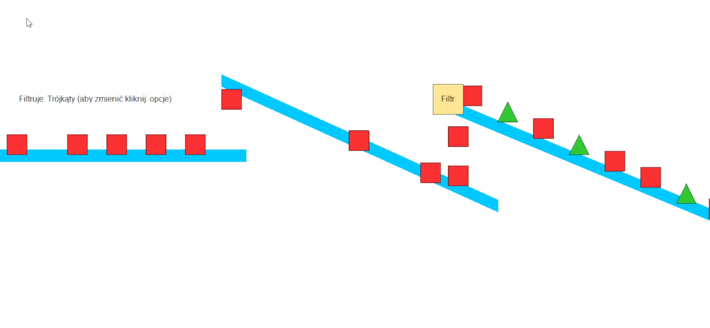

# Projekt 4 – Symulacja taśmociągu z filtracją kształtów

Aplikacja okienkowa w języku C++ z użyciem WinAPI i GDI+, która symuluje poruszanie się obiektów po taśmociągach z możliwością filtrowania oraz zmiany parametrów działania programu.

## Funkcjonalności

- Poruszanie się kształtów (koła, kwadraty, trójkąty) po zdefiniowanej trasie.
- Filtrowanie kształtów w jednym z punktów trasy.
- Zliczanie poprawnie i błędnie odfiltrowanych obiektów.
- Menu kontekstowe pozwalające zmieniać:
  - Filtrowany kształt (Koło / Kwadrat / Trójkąt),
  - Dozwoloną kombinację generowanych kształtów,
  - Prędkość taśmy (wolno / normalnie / szybko),
  - Częstotliwość generowania obiektów (wolna / normalna / szybka).

## Wymagania

- Kompilator obsługujący WinAPI (np. MSVC)
- System Windows
- Biblioteka **GDI+**

## Kompilacja

W Visual Studio:
1. Utwórz nowy projekt WinAPI.
2. Dodaj wszystkie pliki źródłowe (`*.cpp`, `resource.h`, `projekt 4.h`, itd.)
3. Upewnij się, że w `Linker > Input` dodano bibliotekę: `Gdiplus.lib`
4. Skopiuj plik `.rc` z definicją menu i ikon (jeśli używany).

## Obsługa programu

- Program uruchamia się automatycznie z poruszającymi się obiektami.
- Menu dostępne w górnej belce umożliwia zmianę ustawień.
- Filtrowany kształt oznaczony jest na ekranie, a liczba poprawnych i błędnych przejść jest wyświetlana.

## Zrzut ekranu

Poniżej przykładowy widok działania programu:

## Autorzy

Ignacy Pałkowski - 203611
Mikołaj Piegat - 203294

